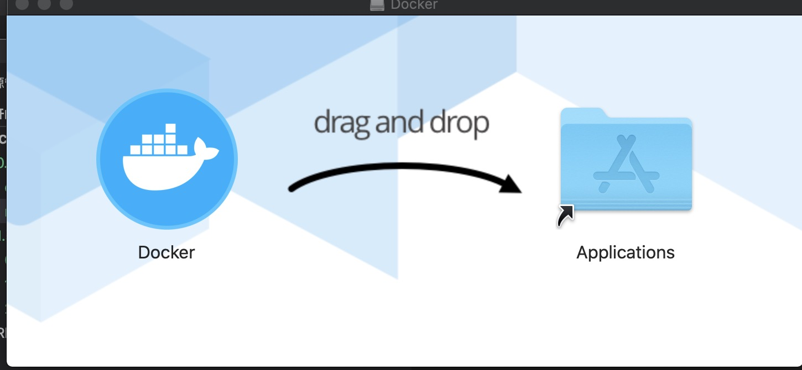
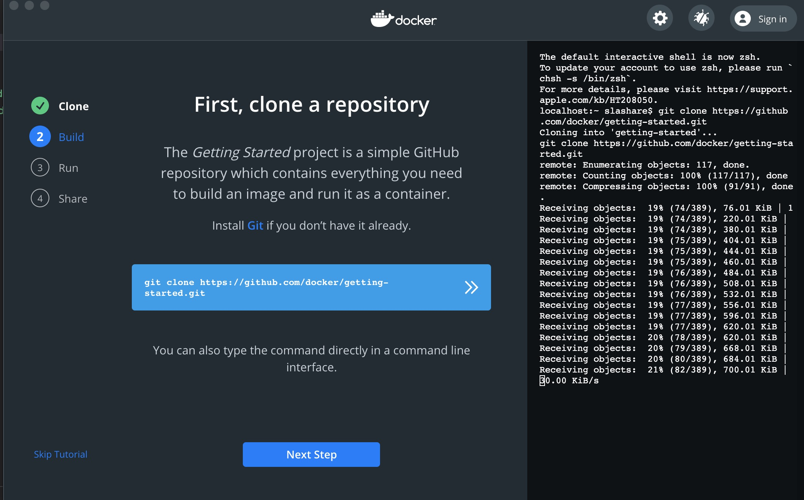
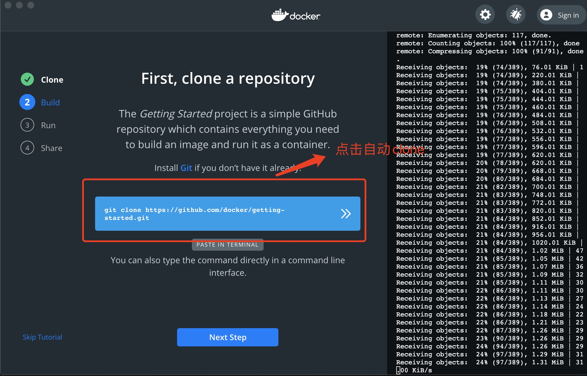
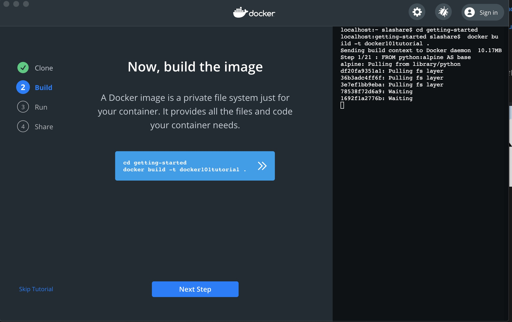
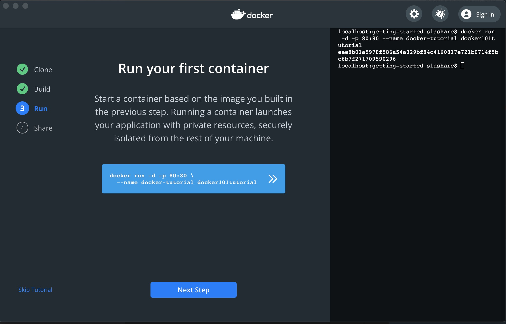
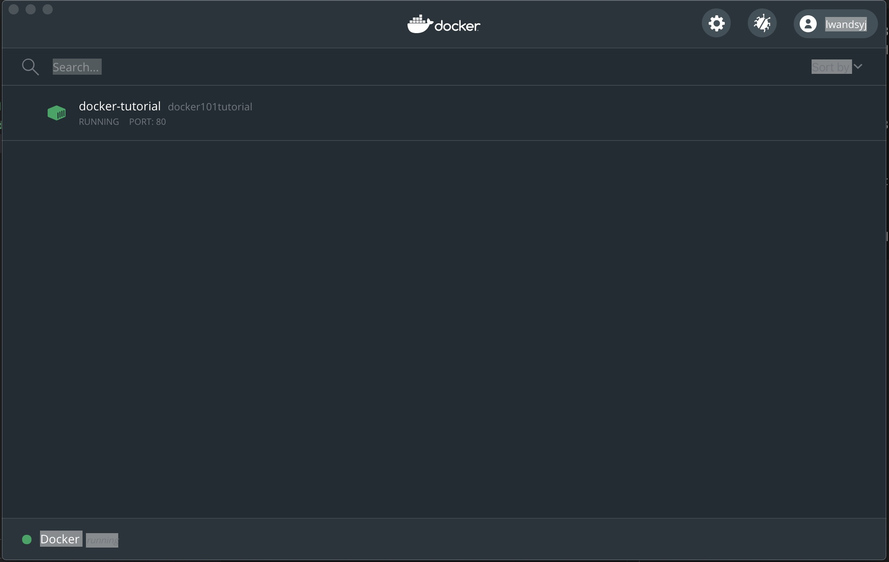

1. 下载docker

https://docs.docker.com/docker-for-mac/install/

https://hub.docker.com/editions/community/docker-ce-desktop-mac/

下载docker  docker.dmg

2.  下载完以后，打开docker.dmg 会自动安装，然后

把docker 放到应用程序

3. 在应用程序中找到docker 

点击docker，安装启动docker

        docker version
+ 启动界面

+ 克隆代码

+ 创建 build

        docker build

+ run

4. docker面板

