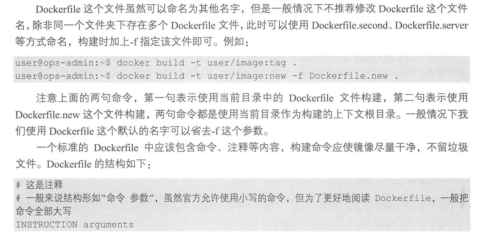

1. 镜像 image

   

+ 从docker hub 拉取镜像，比如ubuntu 

   docker hub 地址 <a href="https://hub.docker.com/" target="_blank">https://hub.docker.com/</a>

        sudo docker pull ubuntu:latest

        格式： docker pull <镜像名称>:<tag标签>

        如果不设置标签，默认为拉取最新latest

        指定用户名，在/ 之前指定用户名
        
        pyrasis/ubuntu:latest // 下载指定用户上传的镜像

2. 列出所有镜像 

        sudo docker images

        或者

        sudo docker image ls

   

3. 删除镜像

        sudo docker rmi imageID(镜像id)

    

4. 根据dockerfile 生成镜像

    docker build 是构建镜像用到的重要命令。 从 docker build 的帮助信息中看到， build 这个子命令的功能非常强大。 通过丰富的参数设置，可以控制镜像构建的各项细节。
    
    常用的参数如下:

+ -c ：控制 CPU 使用 
+ -f： 选择 Dockerfile 目录。
+ -m ： 设置构建内存上限 。
+ -q ： 不显示构建过程的一些信息 。
+ -t ：为构建的镜像打上标签。

    构建镜像的基本命令格式是：

       sudo docker build -t user_name/image_name:tag .

   ***其中命令后面的小数点符号不能省略，它表示当前目录的 Dockerfile 文件***。
   
    Docker 镜像构建是讲究上下文的，因此不能把 dockerfile 乱放

   

5. 提交镜像 docker commit

6. 发布

        docker push username/images

7. 打标签 docker tag

   我们只能推送镜像到自己有管理权限的仓库中 。 假i呈现有用户名为 username 的用户，想推送一个 user/image 的镜像到 Docker Hub 中，有什么办法呢？

   最简单就是给镜像重新打标签，重新打标签之后，镜像内容不变，只是名称改变了 。

        docker tag user/image username/image