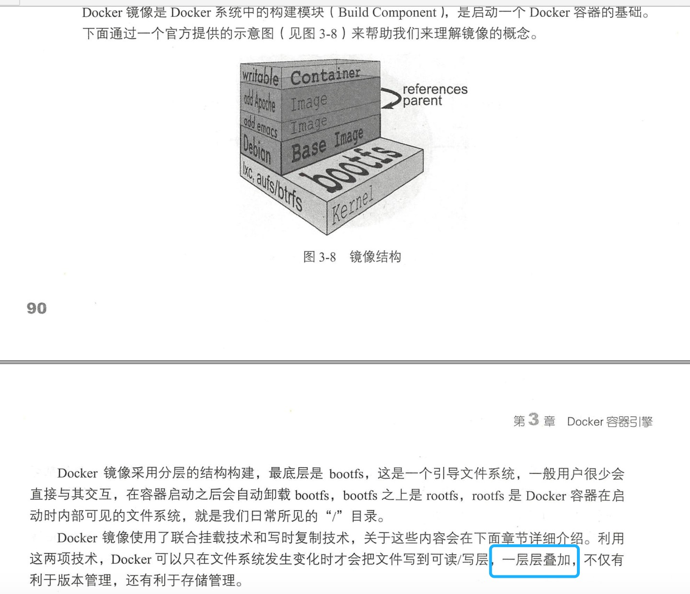
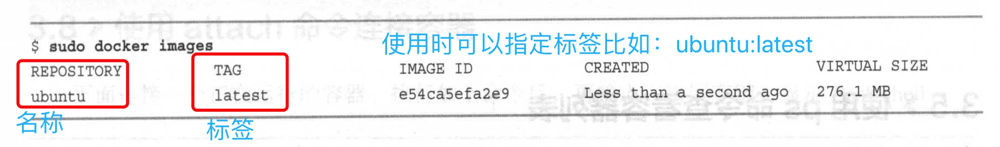
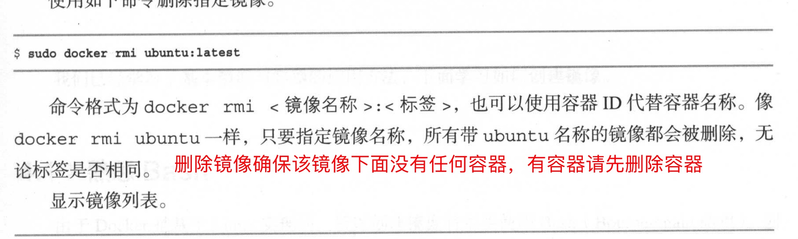

1. 镜像 image

   

+ 从docker hub 拉取镜像，比如ubuntu 

   docker hub 地址 <a href="https://hub.docker.com/" target="_blank">https://hub.docker.com/</a>

        sudo docker pull ubuntu:latest

        格式： docker pull <镜像名称>:<tag标签>

        如果不设置标签，默认为拉取最新latest

        指定用户名，在/ 之前指定用户名
        
        pyrasis/ubuntu:latest // 下载指定用户上传的镜像

2. 列出所有镜像 

        sudo docker images

        或者

        sudo docker image ls

   

3. 删除镜像

        sudo docker rmi imageID(镜像id)

    
