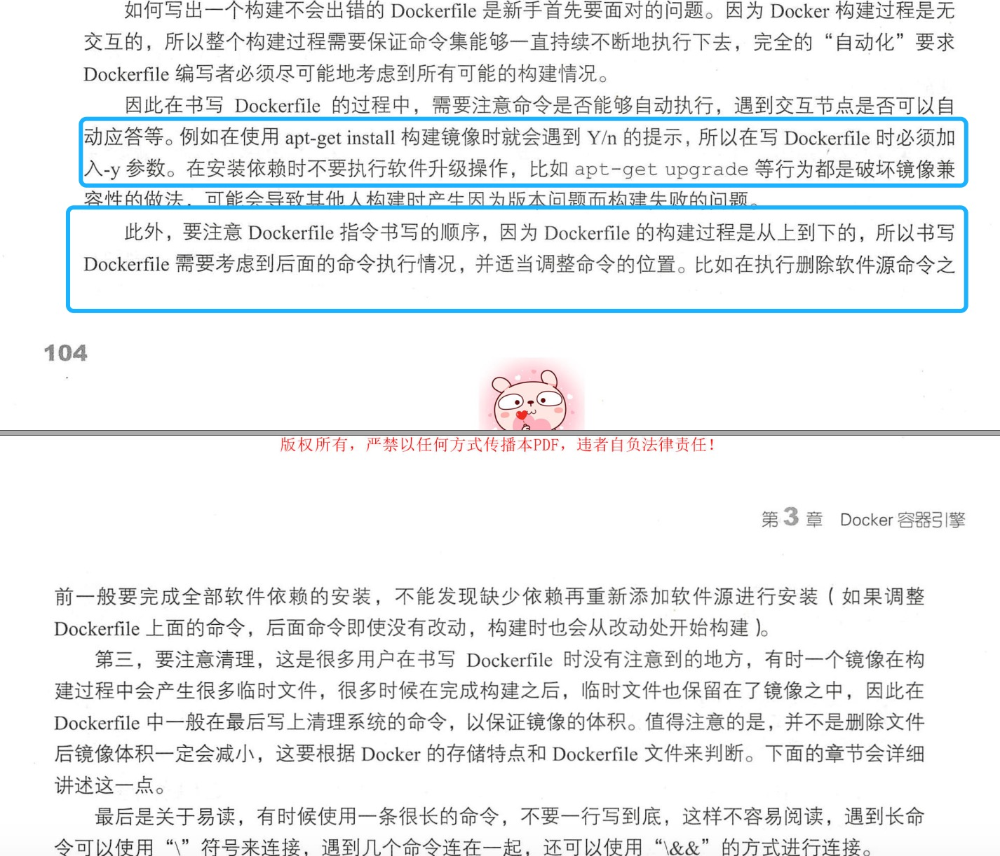
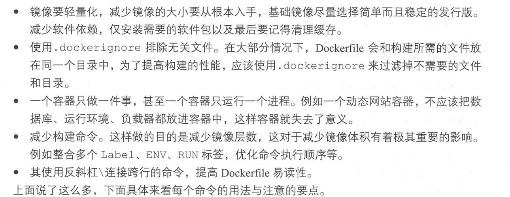
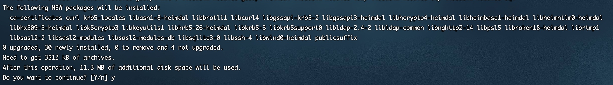
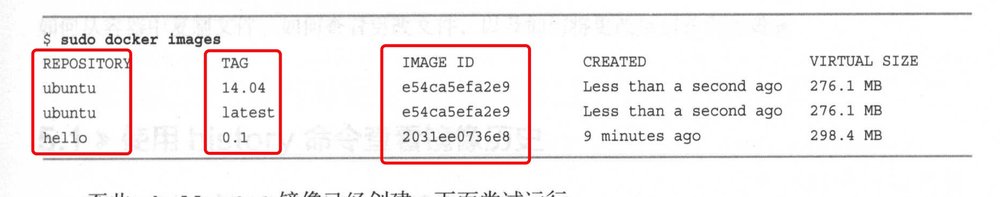

1. dockerfile 是docker 镜像（image) 设置文件，用于生成docker 镜像

   镜像所显示的每一个层(layer）文件夹意味着它是由一句 Dockerfi le 命令生成的 。

   在构建镜像的过程中 ，像 RUN、 COPY 、 ADD 、 CMD 等命令都会生成一个新的镜像层，一个镜像就是不断在上一个镜像层的基础上叠加上去的 。
   
    为了更直观地了解一个镜像的历史，可以使用 docker history 来看镜像的历史 。

    

    

   > .dockerignore 过滤掉不需要的文件和目录

2. FROM： 指定基础镜像

   FROM 必须要在第一行

   格式： FROM <镜像名称>:<tag标签>

3. RUN： 执行shell 脚本或命令

+ run 可以运行在from 之后任意位置，可以有多条记录

+ run 是在构建镜像时执行，

+ 在run 中执行apt install 加上-y

   因为创建镜像过程中不能接收用户输入，所以在apt install 命令上加上-y

        RUN apt update
        RUN atp install -y nginx

   

4. VOLUME: 要与主机共享的目录，主机可以访问，docker中也可以访问

    也可以在docker run 是使用-v 设置

        /root/data:/data 将主机的/root/data 目录连接到Docker 容器的/data 目录

5. workdir: 设置工作目录

+ workdir 可以为后面的RUN CMD等设置当前工作目录

+ 进入docker 容器默认进入的目录

+ EXPOSE： 与主机相连的端口号

98. 使用build 命令创建镜像

     命令格式：docker build < options > <dockerfile 路径>

            sudo docker build --tag hello:0.1 .（.表示当前目录）

            --tag ,-t 设置标签，若只是设置镜像名称，标签就会设置为latest
    
     查看image

            sudo docker images
    
    

99. 运行docker

        sudo docker run --name hello-nginx -d -p 80:80 -v /root/data:/data hello:0.1

        -p: 主机端口：docker 端口

           选项将主机的80端口和容器的80端口连接起来，并暴露到外部，这样设置后，连接http://<主机IP>:80 就会连接到容器的80号端口

        -v : 主机目录：docker 目录

            /root/data:/data 将主机的/root/data 目录连接到容器的/data 目录，若将文件放入/root/data 目录，则能从容器读取相应的文件

  