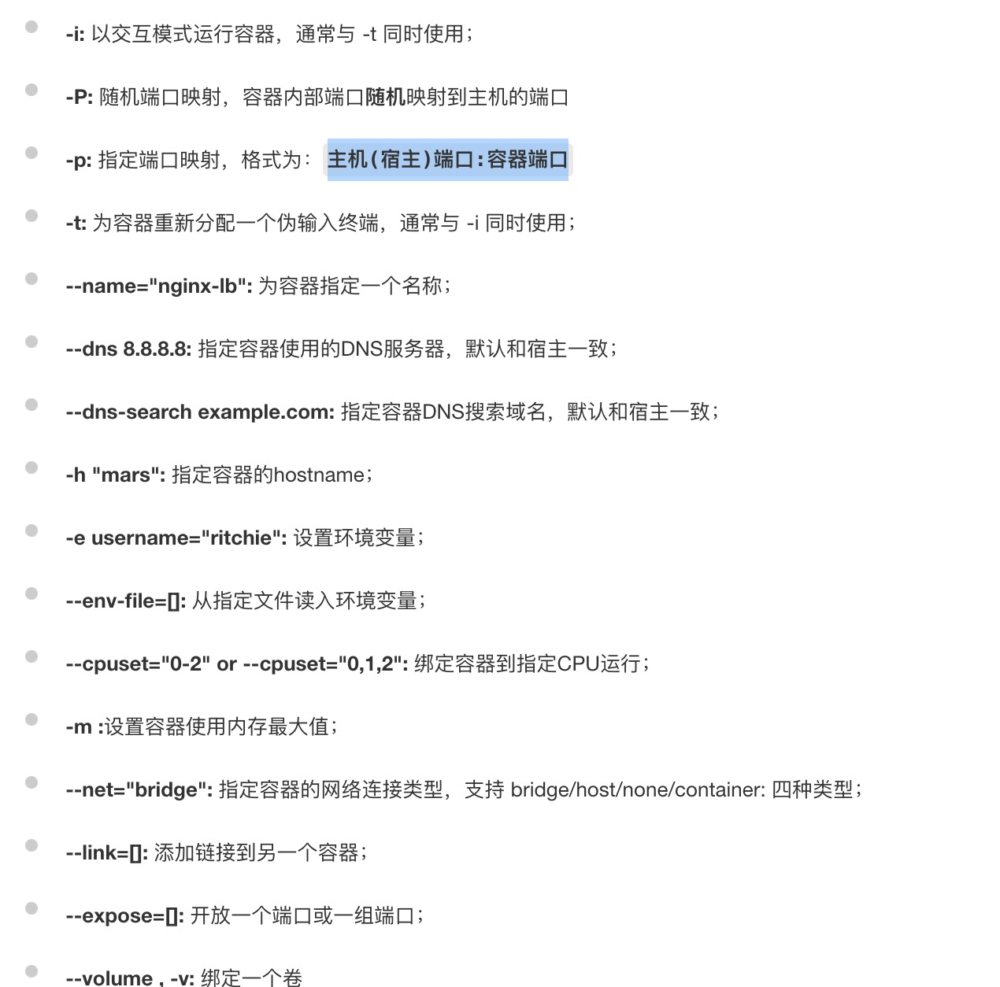
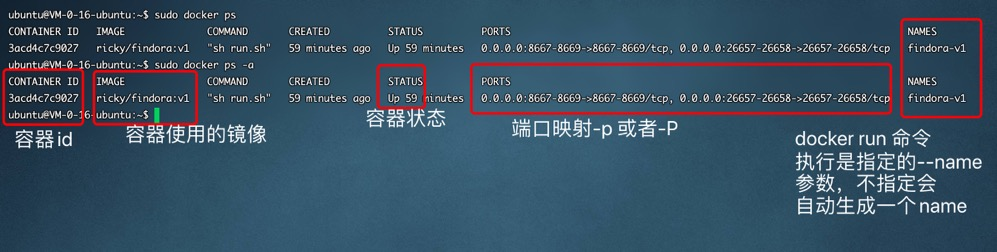

1. 容器是docker 镜像的运行实例。

   容器时docker run 执行后生成的容器，同一个镜像执行一次run 可以生成一个容器

2. 根据镜像启动容器 docker run 

        sudo docker run -d -p 80:80 -p 81:81 --name test-1 ubuntu:latest

        -d: 容器后台运行
        -p: 把docker 中要公开的端口映射到本地机器，主机(宿主)端口:容器端口
        --name: 给容器指定一个名称，若不指定名称，docker会自动生成一个名称
        ubuntu:latest： 使用的具体镜像名称：tag标签

        sudo docker run -d -P --name test-2 ubuntu:latest

        -P 会自动生成相应的端口匹配dockerfile expose 中公开的端口号，随机端口映射，容器内部端口随机映射到主机的端口

   

2. 查看容器

        sudo docker ps // 正在运行的docker

        或者

        sudo docker ps -a // a-all 的简写，所有包括容器状态为停止的

    

3. stop/start/restart 

+ stop 停止容器

        sudo docker stop containerID(容器id)

+ start 启动容器

        sudo docker start containerID(容器id)

+ restart 重启容器

        sudo docker restart containerID(容器id)

4. 删除容器

   删除容器，必须保证容器已停止

        sudo docker stop containerID(容器id)

        sudo docker rm containerID(容器id)

5. 进入容器内部

        sudo docker exec -it containerId(容器id) /bin/bash

        执行命令

        sudo docker exec -it containerId(容器id) ifconfig

   

  