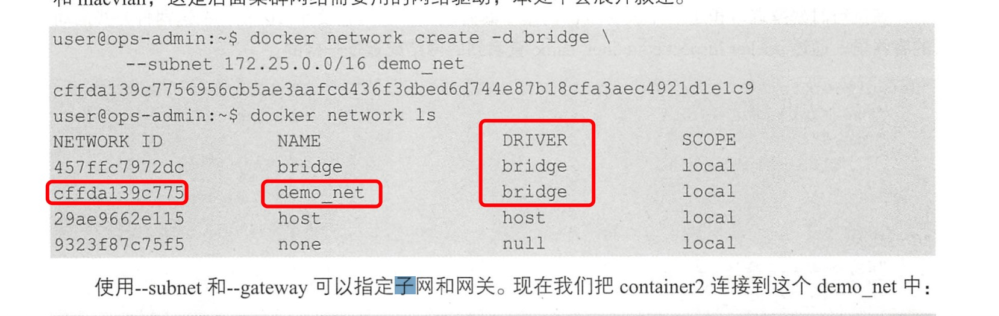
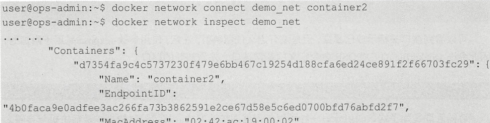
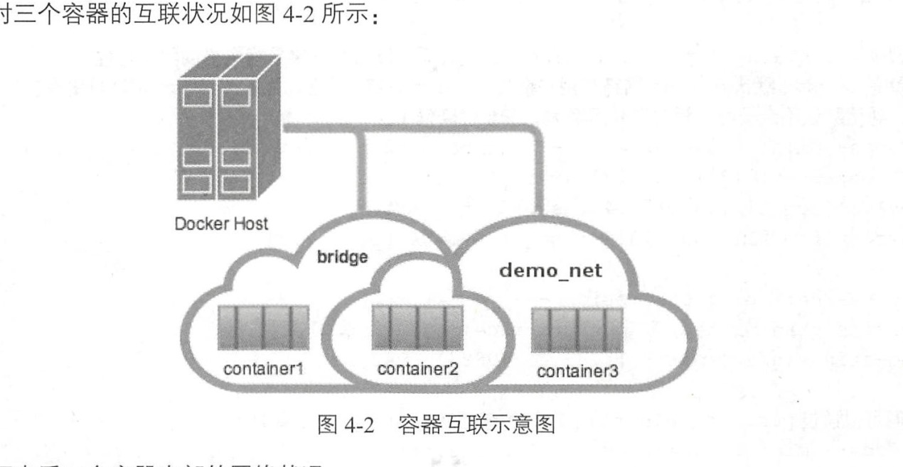

1. 端口映射

   ***在docker 中容器默认是无法与外部通信的，需要在启动命令中加入对应的参数才允许容器与外界通信***

   当容器运行在一个web 服务时，需要把容器内的web 服务应用程序端口映射到本地宿主机的端口。
   这样，用户访问宿主机指定的端口，就相当于访问容器内的web 服务端口.

   使用-p 和 -P 端口映射。

   -p: 指定端口  <宿主机端口>:<容器端口> -p 81:80

   -P: 会随机映射一个容器中公开的端口，（expose 中导出的端口）

        docker run -d -p 8000 : 80 -p 4430 : 443 --name test nginx:alpine

+ 格式二（ Local IP:Local Port:Container Port )
    
    与格式一不同，格式二可以映射到指定地址的指定端口，***比如映射到 127.0.0.1 就会造成这个端口只能通过本机访问，外部无法访问这个容器服务，一般在测试等环境下会用到*** 。 同样地，如果指
    定了一个子网 IP ，那么只有在同一个子网内的用户才可以访问，局域网外的用户是无法访问的 ：
    
         sudo docker run -d -p 127.0.0.1:8000:80 --name test nginx:alpine

+ 格式三 （指定传输协议）

    上面三种格式还可以使用 tcp 或者 udp 标记来指定端口，例如：

        docker run -d -p 80:80/tcp --name test nginx:alpine

        docker run -d -p 80:80/udp --name test nginx:alpi

2. 暴露端口

   dockerfile 中EXPOSE 

   或者运行时使用 --expose

3. 容器互联

   ***端口映射是主机与容器之间的通信，容器互联是容器之间的通信***

   把两个容器放进一个用户自定义的网络中， --link(弃用)

   原因：

   设想一下这样一个应用，后端容器需要一个数据库，数据库容器和后端服务容器如果使用上下文中的暴露端口或者映射端口来通信，势必会把数据库的端口也暴露在外网中，导致数据库容器的安全性大大降低，为了解决这个问题，docker 允许用户建立一个独立的网络来放置相应的容器，只有在网络中的容器才能相互通信，外部容器是无法进入这个特定的网络中的。

   

   > 创建一个独立的容器网络，使用bridge 驱动(桥接模式)

        sudo docker network create -d bridge --subnet 172.25.0.0/16 demo_net
    
    

   > 容器连接网络

        sudo docker network connect demo_net container2

        把congtianer2 连接到demo_net 中
    
    

   > 启动时连接网络

        docker run --network=demonet \
        “-ip=172.25.3.3 -itd --name=container3 busybox

   