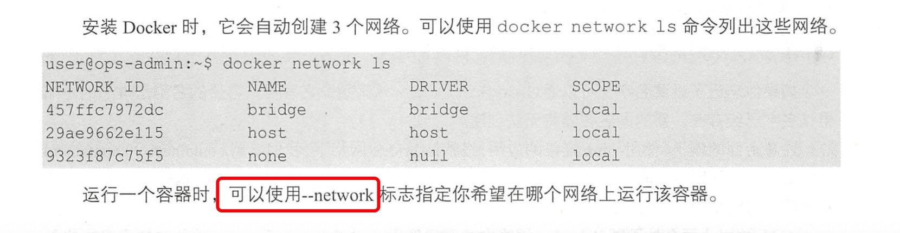

1. 网络模式

    安装docker 时，会自动创建3个网络

        sudo docker network ls
    
    

2. 模式介绍

   > none 模式

   none 模式表示不为容器设置任何网络功能，启用该模式只需要在运行时（docker run) 使用--net=none 即可。

   使用none模式启动表示容器完全失去网络功能，即使设置了端口映射

        sudo run -d -p 8000:80 --name test --net=none abi/cad:php
    
    > container 模式

    这个模式表示与另一个运行中的容器共享一个network Namespace.

    > host 模式

    docker  run  --net=host就可以指定了这种网络模式。这种模式，容器直接复用了宿主机的ip，并且使用了宿主机的所有网卡，也就是在容器里ifconfig查看到的内容和宿主机查看的一模一样。
    比如： 
        
        docker run -it --rm --net=host  sentos:lqf  bash
   这个命令的--rm意思就是，这个容器退出后，该容器就自动被删除。

   > bridge 模式---默认模式

   

   > overlay 模式

   